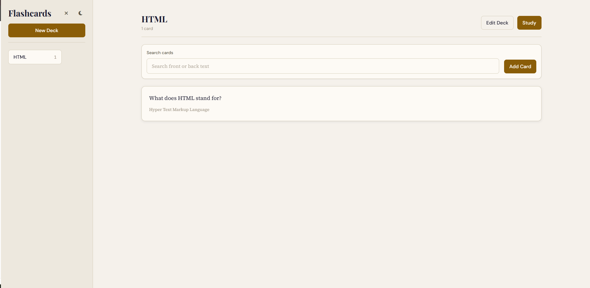
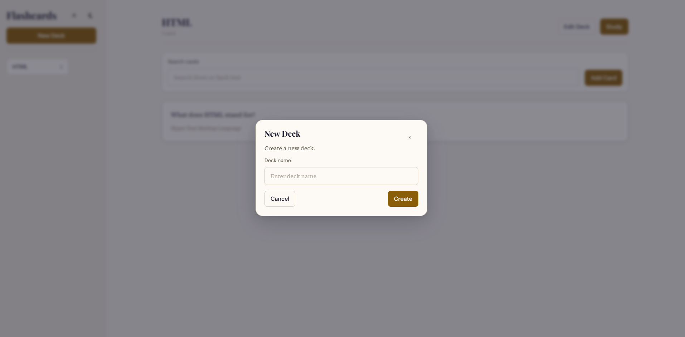
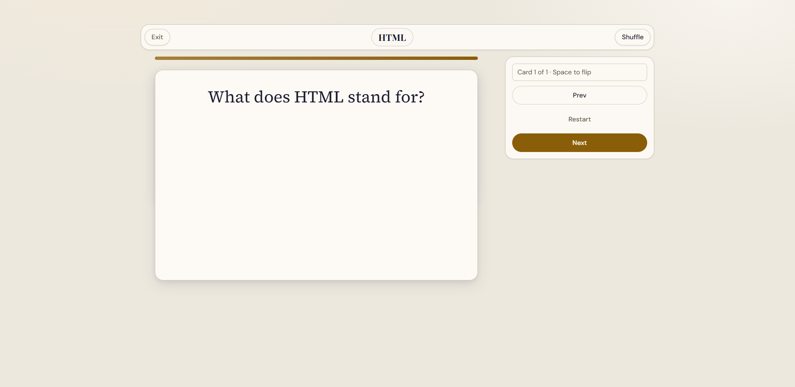
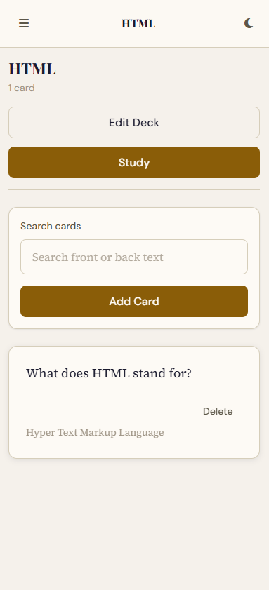

# Flashcards App

A clean, accessible, and responsive flashcards web app built with Vanilla JavaScript, designed for fast deck creation, focused study sessions, and distraction-free review.

## Table of Contents

- [Demo Preview](#demo-preview)
  - [Home View](#home-view)
  - [Deck View](#deck-view)
  - [Study View](#study-view)
  - [Mobile View](#mobile-view)
- [Features](#features)
  - [Core Product Features](#core-product-features)
  - [UX and Interface Features](#ux-and-interface-features)
  - [Accessibility Features](#accessibility-features)
- [Tech Stack](#tech-stack)
- [Architecture](#architecture)
- [Data Model and Persistence](#data-model-and-persistence)
  - [Storage Keys](#storage-keys)
  - [Data Shape (High-Level)](#data-shape-high-level)
- [Responsive Design](#responsive-design)
- [Getting Started](#getting-started)
  - [Option 1: Open Directly](#option-1-open-directly)
  - [Option 2: Serve Locally (Recommended)](#option-2-serve-locally-recommended)
- [Project Structure](#project-structure)
- [Usage Guide](#usage-guide)
- [Quality, Accessibility, and Design Notes](#quality-accessibility-and-design-notes)
- [Known Limitations](#known-limitations)
- [Roadmap](#roadmap)
- [Reflection: My Thoughts](#reflection-my-thoughts)

## Demo Preview

### Home View



The main dashboard shows the deck sidebar, primary workspace, and the app's clean study-first layout.

### Deck View



The deck screen focuses on card management with search, card previews, and quick actions.

### Study View



Study mode presents one card at a time with flip interaction and streamlined review controls.

### Mobile View



On smaller screens, the app switches to a mobile-first navigation pattern with an off-canvas sidebar and responsive study layout.

## Features

### Core Product Features

- Deck management: create, rename, delete, and select decks.
- Card management: create and delete flashcards inside a deck.
- Search and filter: quickly narrow visible cards in the active deck.
- Study mode: flip, next, previous, restart, and exit session controls.
- Shuffle support in study mode.

### UX and Interface Features

- Responsive layout for desktop, tablet, and mobile.
- Mobile off-canvas sidebar with overlay and keyboard-safe close behavior.
- Light and dark theme support with persisted preference.
- Subtle motion and reduced-motion support.
- Toast notifications and confirmation/input modals.

### Accessibility Features

- Semantic regions and ARIA labels/attributes.
- Keyboard-first interaction patterns.
- Focus management for modal dialogs.
- Live-region announcements in study interactions.

## Tech Stack

- HTML5
- CSS3 (modular files, design tokens, responsive layout)
- Vanilla JavaScript (ES modules)
- Browser Local Storage (persistence)
- Font Awesome (icons)
- Google Fonts (typography)

No framework and no build tooling are required.

## Architecture

The app is organized as a small modular SPA with a central orchestrator and feature modules.

- `js/app.js`: App bootstrap, global state orchestration, event delegation, render flow.
- `js/ui.js`: View rendering and UI markup generation.
- `js/store.js`: Persistence layer and localStorage schema access.
- `js/decks.js`: Deck domain actions/events.
- `js/cards.js`: Card domain actions/events.
- `js/study.js`: Study session state machine and controls.
- `js/search.js`: Card filtering logic.
- `js/keyboard.js`: Keyboard-specific support hooks.

Rendering is view-based (`home`, `deck`, `study`) and event-driven through custom events (`deck:*`, `card:*`, `study:*`).

## Data Model and Persistence

Data is persisted entirely in localStorage.

### Storage Keys

- `flashcards_decks`
- `flashcards_cards`
- `flashcards_settings`

### Data Shape (High-Level)

- Deck: `id`, `name`, `createdAt`, `updatedAt`
- Card: `id`, `deckId`, `front`, `back`, `createdAt`, `updatedAt`
- Settings: `themePreference` and related UI settings

Because storage is local-only, data does not sync across browsers/devices.

## Responsive Design

The UI uses breakpoint-aware layouts:

- Desktop: persistent sidebar + main content region.
- Mobile: topbar trigger + off-canvas sidebar + backdrop.
- Study mode: adaptive card/control layout by viewport size.
- Safe-area insets considered for modern mobile devices.

## Getting Started

### Option 1: Open Directly

1. Clone this repository.
2. Open `index.html` in a modern browser.

### Option 2: Serve Locally (Recommended)

Using Python:

```bash
python -m http.server 8080
```

Then open `http://localhost:8080`.

Using Node (if installed):

```bash
npx serve .
```

Then open the URL shown in your terminal.

## Project Structure

```text
flashcards-app/
  index.html
  README.md
  ACCESSIBILITY.md
  ARCHITECTURE.md
  DATA.md
  FEATURES.md
  INSTRUCTIONS.md
  STUDY_MODE.md
  UI_DESIGN.md
  css/
    animations.css
    base.css
    components.css
    layout.css
    study.css
  js/
    app.js
    cards.js
    decks.js
    keyboard.js
    search.js
    store.js
    study.js
    ui.js
```

## Usage Guide

1. Create a new deck from the sidebar.
2. Open the deck and add cards (front/back).
3. Use search to filter cards.
4. Start Study Mode and flip cards with keyboard or click.
5. Use `Prev`, `Next`, `Restart`, and `Shuffle` to drive your review flow.
6. Switch theme from the top-right theme toggle.

## Quality, Accessibility, and Design Notes

Project conventions and standards are documented in:

- `INSTRUCTIONS.md`
- `ARCHITECTURE.md`
- `ACCESSIBILITY.md`
- `UI_DESIGN.md`
- `STUDY_MODE.md`

These docs describe implementation constraints, expected UX behavior, and design system guidance.

## Known Limitations

- No authentication or user accounts.
- No cloud sync; persistence is browser-local only.
- No backend API (fully client-side).
- No automated test suite included yet.

## Roadmap

- Add import/export for decks and cards.
- Add spaced repetition modes and progress tracking.
- Add card editing and bulk operations.
- Add automated tests (unit + integration smoke tests).
- Add optional backend sync for multi-device continuity.

## Reflection: My Thoughts

This was my first time seriously using AI in my coding workflow, and it made a noticeable difference. Copilot created a more efficient environment.


Where AI saved me the most time was on structure and repetitive work. Things like responsive layout updates, organizing sections, and writing cleaner UI code got done much quicker than if I did everything from scratch. Before I began, I created some instructions for Copilot in MD files and had Copilot scan these files. I made that as a baseline so the AI wouldn't steer too far away from the topic of this project.


One pitfall to using AI during a workflow such as this is inconsistencies in code quality. Sometimes AI creates bugs that you have to search for and find, which was the downside in this project. For example, a bug I learned a lot from was the dark mode toggle animation not working. After setting up the starter code for Copilot, I had it read the instructions and create a plan based off my code for implementation, and then execution began. At first, it looked like the CSS was correct, but the animation still did not show. The real issue was that the whole screen was re-rendering, so the animation could not run properly. The fix was to update only the toggle state directly instead of reloading the full view.


The biggest prompt lesson I learned was specificity. When I asked for broad changes, I got broad output. When I asked for the plan first, a minimal patch only, and exact changes, the output became much better and less overwhelming. AI helped me build faster, but I still had to review, test, and decide what made sense.